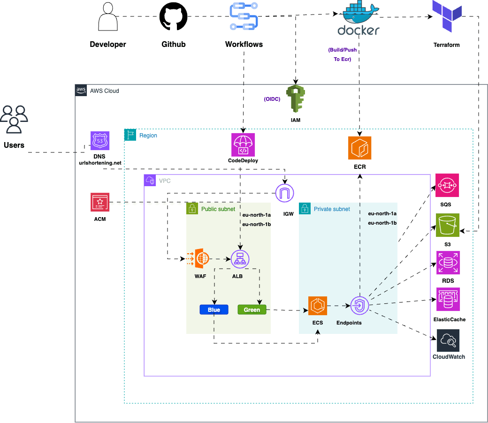
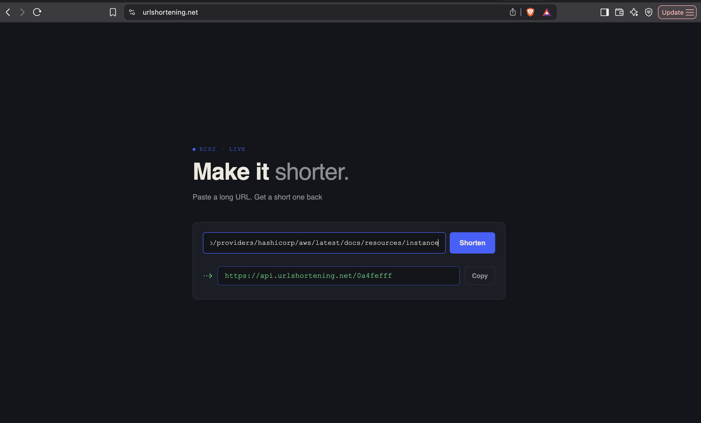
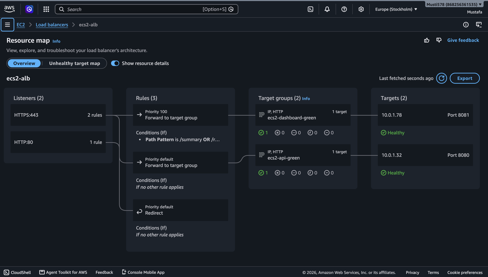
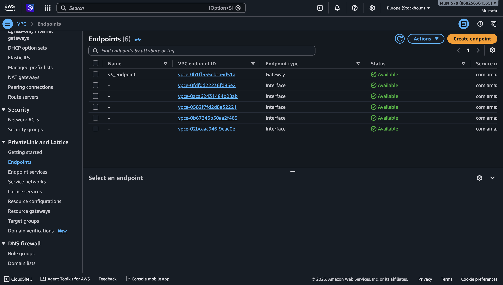
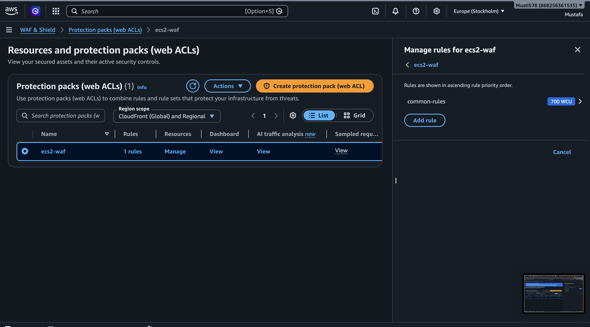
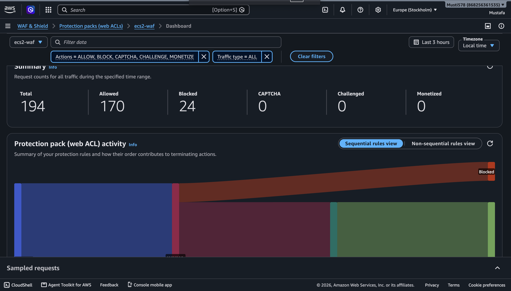
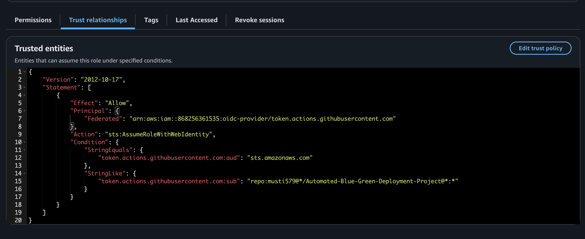

# Automated Blue-Green Deployment

This is a production-style platform for a FastAPI URL shortener on AWS. Infrastructure is managed with Terraform, and delivery is keyless through GitHub OIDC. Releases use CodeDeploy blue-green deployments to ECS Fargate behind an ALB. The ALB terminates TLS through ACM and is protected by WAF. The platform runs three independent services an API, a background worker, and a dashboard backed by RDS, ElastiCache, and SQS, with a static frontend served through CloudFront.


## Project Overview

- **AWS ECS Fargate** — serverless, scalable compute hosting three services: API, background worker, and dashboard
- **Networking** — custom VPC across two Availability Zones, public/private subnets, route tables, security groups, ALB
- **AWS WAF** — filters web requests in front of the ALB for enhanced security
- **VPC Endpoints** — cost-efficient private access to ECR, SQS, S3, and CloudWatch, eliminating the need for a NAT gateway
- **PostgreSQL (RDS)** — stores URL mappings and click analytics
- **ElastiCache (Redis)** — in-memory cache in front of RDS on the redirect path
- **SQS** — decouples click events between the API and worker
- **TLS/DNS** — SSL certificates via ACM, DNS via Route 53, fully automated
- **CodeDeploy** — blue-green deployments to ECS Fargate for the API and dashboard
- **GitHub Actions** — CI/CD pipelines to build/scan/push images and deploy Terraform-provisioned infrastructure, authenticated via OIDC
- **Infrastructure as Code (Terraform)** — manages all infrastructure, fully automated

## Architecture





## Live Demo 

 Production URL shortener running on ECS Fargate with HTTPS and WAF protection.


## Repository Structure


```text
Automated-Blue-Green-Deployment/
├── .github/
│   └── workflows/
│       ├── build-and-push.yml      # Build and push Docker image to ECR
│       ├── deploy.yml     # Deploy updated task definition to ECS
│       └── terraform.yml  # Validate, scan, and plan Terraform changes
├── app/
├── images/
├── service/
├── terraform/
│   ├── bootstrap/ 
│   ├── frontend/          # One-time setup: S3 backend, ECR, OIDC, IAM roles
│   ├── modules/
│   │   ├── acm/
│   │   ├── alb/
│   │   ├── codedeploy/
│   │   ├── ecr/
│   │   └── ecs/
│   │   └── elasticcache/
│   │   └── endpoint/
│   │   └── rds/
│   │   └── sqs/
│   │   └── vpc/
│   ├── main.tf
│   ├── output.tf
│   └── provider.tf
│   └── variables.tf
└── .gitignore
├── docker-compose.yml
├── README.md
```

## Network Componenets





## GitHub OIDC trust setup



## Prerequisites

You need an AWS account with permissions to create IAM, ECR, ECS, RDS, ElastiCache, SQS, ALB, ACM, Route 53, CloudFront, and CodeDeploy resources. You also need a public domain and a Route 53 hosted zone, so ACM can complete DNS validation and traffic can resolve to the ALB and CloudFront. Install Terraform version 1.6 or later, AWS CLI version 2, Docker, and Git. You also need GitHub repository admin access so you can set secrets and run workflows.

You must define this GitHub repository secret before running pipelines:

- `AWS_ROLE_ARN` which points to the IAM role that trusts GitHub OIDC.

### Setup steps

1. Run bootstrap Terraform from bootstrap/ one time so the state bucket, OIDC provider, and GitHub Actions deploy role exist.
2. Add the bootstrap role's ARN to the repository secret AWS_ROLE_ARN.
3. run the main infrastructure from terraform/ so networking, RDS, ElastiCache, SQS, ECS, ALB, WAF, CodeDeploy, and the frontend get created.

```bash
cd terraform
terraform init -reconfigure
terraform plan
terraform apply
```

4. Push changes to app/**, services/dashboard/**, or services/worker/** (or trigger build-and-push.yml manually) so the images build, scan, and push to ECR.
5. Run deploy.yml it resolves the latest pushed tag per service from ECR automatically, registers new task definitions, and starts a blue-green deployment through CodeDeploy for the API and dashboard.


## Security and Guardrails

AWS WAF sits in front of the ALB, using a managed rule set to reduce exposure to common web attacks. The ALB terminates TLS with an ACM-managed certificate and redirects all HTTP traffic to HTTPS. GitHub Actions authenticates to AWS through OIDC, so no long-lived credentials are stored as repository secrets tokens are short-lived and scoped by the role's trust policy, restricted to this specific repository. IAM permissions follow least privilege: separate task roles for the API and worker, a dedicated execution role, and a scoped CodeDeploy service role each limited to what it actually needs. ECS tasks run in private subnets and accept inbound traffic only from the ALB's security group, never directly from the internet. Access to ECR, SQS, S3, and CloudWatch is routed entirely through VPC endpoints, so the platform has no NAT gateway and keeps egress cost and public exposure to a minimum.


## Project Decisions and Tradeoffs

### Infrastructure Design

Module boundaries — split into VPC, ALB, ECS, RDS, ElastiCache, SQS, ECR, CodeDeploy, ACM, and frontend modules. Improves reuse, but the wiring between them is exactly where this project's outage originated.
Bootstrap/workload separation OIDC role and state bucket live in their own bootstrap/ state, separate from terraform/. Cleaner lifecycle boundaries, two entry points to remember.

### Network and Security

Private subnets + VPC endpoints — no NAT gateway, lower cost and exposure, at the cost of harder network debugging.
ALB + ACM + WAF — managed TLS and L7 filtering, more moving parts to keep in sync (a CodeDeploy-managed listener rule got silently reverted mid-project until ignore_changes was added).
OIDC over long-lived keys short-lived, scoped credentials; trust-policy drift (repo renames, GitHub's newer sub claim format) can break it fast.

### Delivery

Three separate workflows (build, deploy, terraform) isolated failure domains, more manual orchestration than one pipeline.
Commit-SHA tags, resolved automatically at deploy closes the gap that caused the original outage; Terraform's own :latest bootstrap default still needs something pushed under that tag at least once.
CodeDeploy blue-green (single-shot, not canary) for API/dashboard, plain rolling for worker — health-checked traffic shift with auto-rollback, but requires strict target-group/listener consistency.
CI/CD and Deployment Flow
build-and-push.yml — builds all three service images, scans with Grype, pushes to ECR tagged with the commit SHA.
deploy.yml resolves each service's most recently pushed tag directly from ECR (no manual input), registers new task definitions, deploys via CodeDeploy (API/dashboard) or update-service (worker).
terraform.yml TFLint + Checkov, then plan/apply, gated behind a typed confirmation.